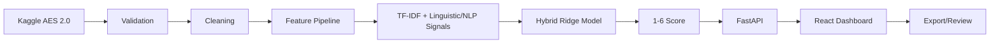

# ESSAYIQ
## AI-Powered Automated Essay Scoring & Writing Analytics Platform

EssayIQ is a production-oriented academic/research prototype that connects licensed essay data, validation, conservative NLP preprocessing, hybrid feature engineering, regression-based automated scoring, analytical writing indicators, FastAPI inference, a React/Vite dashboard, testing, and Docker deployment.

> **Important:** the score is an automated statistical estimate. It is an aid to review, not a definitive replacement for qualified human assessment.

## Architecture



## Quick start

### Backend

```bash
python -m venv .venv
# Windows: .venv\Scripts\activate
# macOS/Linux: source .venv/bin/activate
pip install -r requirements.txt
copy .env.example .env   # Windows
# cp .env.example .env   # macOS/Linux
```

Configure Kaggle credentials using the normal Kaggle mechanism, then:

```bash
python -m src.data.download
python -m src.data.validate
python -m src.models.train
python -m src.evaluation.evaluate
pytest -q
uvicorn src.api.main:app --reload
```

API: `http://localhost:8000/docs`

### Frontend

```bash
cd frontend
npm install
npm run dev
```

Set `VITE_API_BASE_URL` if the backend is not running on localhost:8000.

## Dataset

EssayIQ is designed around the Learning Agency Lab Automated Essay Scoring 2.0 competition dataset. The repository intentionally does not redistribute the raw student essays. See `docs/DATASET.md`.

## Training and evaluation

The training command creates the hybrid model only after loading the real local dataset. It does not fabricate metrics. Evaluation reports QWK, MAE, RMSE, Pearson, Spearman, exact agreement, and within-one agreement. QWK uses rounded/clipped predictions while regression metrics retain continuous 1–6 predictions.

## Analytical dimensions

Content, grammar, organization, vocabulary, and readability values are derived analytical indicators. They are **not** independently human-labeled target scores because the primary dataset provides a holistic score.

## Privacy

The API is stateless and does not intentionally log complete essays. Raw dataset files, credentials, generated models, and generated reports are ignored by Git.

## Docker

```bash
docker compose up --build
```

## Project map

- `src/data`: acquisition, validation, cleaning, splitting
- `src/features`: reusable text feature pipeline
- `src/models`: baselines, hybrid model, optional transformer notes, registry
- `src/evaluation`: metrics, plots, error analysis
- `src/services`: scoring and deterministic feedback
- `src/api`: FastAPI endpoints
- `frontend`: responsive EssayIQ dashboard
- `tests`: unit/API tests
- `docs`: architecture, dataset, evaluation, ethics, API and deployment

## Current execution status

This repository is generated from the supplied project specification. No training result is claimed until the user supplies the licensed dataset and runs the training/evaluation commands.
