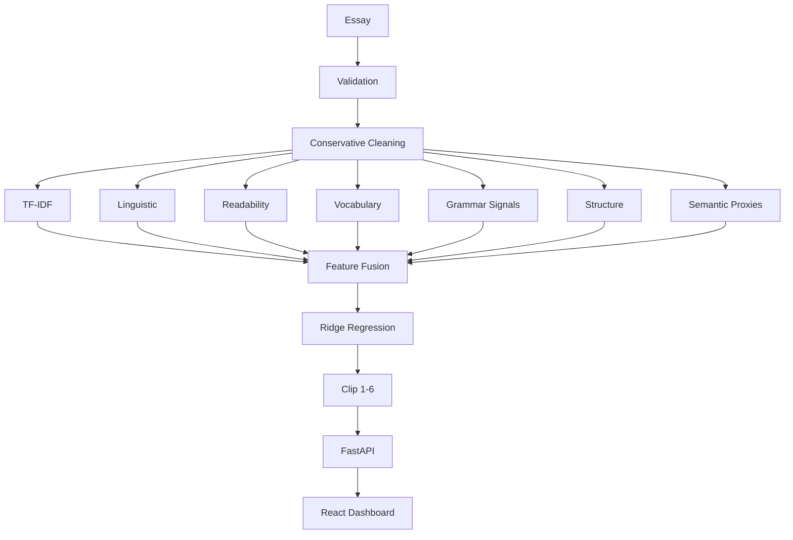

# Architecture

```mermaid
flowchart TD
 A[Essay] --> B[Validation]
 B --> C[Conservative Cleaning]
 C --> D[TF-IDF]
 C --> E[Linguistic]
 C --> F[Readability]
 C --> G[Vocabulary]
 C --> H[Grammar Signals]
 C --> I[Structure]
 C --> J[Semantic Proxies]
 D --> K[Feature Fusion]
 E --> K
 F --> K
 G --> K
 H --> K
 I --> K
 J --> K
 K --> L[Ridge Regression]
 L --> M[Clip 1-6]
 M --> N[FastAPI]
 N --> O[React Dashboard]
```

The same `HybridFeaturePipeline` is serialized with the estimator and therefore reused for training, validation, testing and inference.
